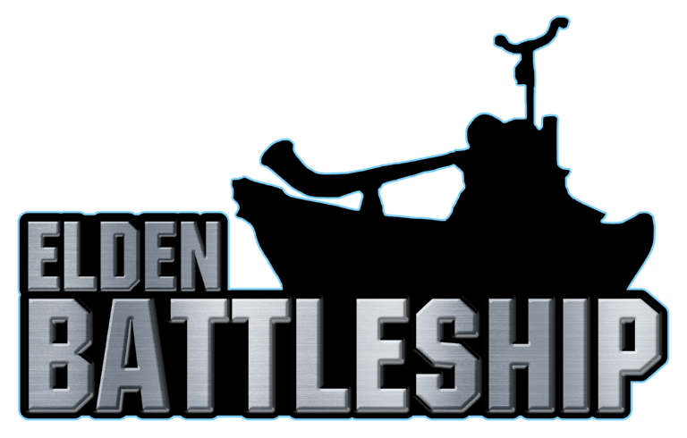

<p align="center">
  
</p>

# Elden Battleship

Battleship on an Elden Ring board, in a browser. Fleets hide ships on a grid of named squares
(bosses, objectives, randomizer dares) and fire at coordinates. Hitting a square means going
and doing the thing written on it.

Built for tournament play: any number of fleets, spectator and caster views, and OBS browser
sources for streaming. Nothing to install to play — click your own squares, or run the Dionysus
overlay and have each one fire itself the moment you kill the boss. See [autofire.md](autofire.md).

**Live:** https://kcbrazos.github.io/Elden-Battleship/

Vite + React + TypeScript, backed by Supabase (Postgres, Realtime, Anonymous Auth), deployed
as a static site to GitHub Pages.

## How a match works

1. **Home.** Create a room, or join with the room's word-pair code.
2. **Lobby.** Players pick a fleet (up to nine, by colour). The host chooses the board size
   (5x5 up to 14x14, capped by how many squares the set holds), the fleet preset, which
   square set the board is dealt from, and whether the match counts — set it to **Practice**
   for a test run or a demo and nothing from it reaches the leaderboard, anyone's career or
   the record book. That is settled in the lobby and cannot be changed once the match starts,
   or undone afterwards.
3. **Placement.** Place each ship, or hit Randomize, then confirm.
4. **Battle.** A countdown, then fire. Real-time rather than turn-based.
5. **Last fleet afloat wins.** The host can start another match in the same room.

One shot hits every other fleet at the same coordinate. You call a square rather than pick a
target, which is what makes a multi-fleet match a race rather than a duel.

## How it stays fair without a game server

There is no backend process refereeing the match. Instead:

- Every browser gets an anonymous Supabase auth session, so it has a stable identity with no
  login screen. Signing in with Twitch is optional and only adds a name and career stats.
- Ship positions live in a `fleets` table under row-level security, so only players seated on
  that fleet can read it. Opponents cannot find your ships by watching network traffic,
  because Postgres refuses the read, not the client code.
- Attacks are resolved by `resolve_attack()`, a `SECURITY DEFINER` function. It locks the
  attack row and then the fleet row, reads the fleet server-side, and returns only
  hit, miss or sunk. Any client can drive it, so a fleet that closes its tab does not strand
  everyone else's shots. The fleet row stays locked for the duration, so two shots landing at
  once cannot both apply.
- Elimination and the winner are decided in that same function, for the same reason: the
  fleet that just lost is the least likely to still be connected to announce it.

Spectators can be granted a read of every fleet, which is what the caster tools use. That
policy is separate and has to be applied by hand, so granting it is always a deliberate choice.

## Streaming

Players get OBS browser sources from the **Stream overlay** button in the lobby or match
screen. Casters get a control page at `/cast/<room code>`.

| Source | Size | What it is |
| --- | --- | --- |
| Board | 1000x1000 | The board itself. A caster aims it live from the control page; a player can pin it to one fleet with `?team=N`. |
| Fleet | 400x400 | Your own ships, for showing chat where they are. Needs `?key=<rejoin code>`. |
| Clock | 1200x200 | Match clock and every fleet's surviving hulls. |
| Key | 1920x90 | A thin colour key for the bottom edge. |
| Audio | 100x100 | The board's sound, with no picture: every shot, every find in the water, the horns and the final sting. |

The Audio source is the room heard rather than watched, and it is a source of its own so that
OBS's mixer can treat it as one - tick **Control audio via OBS** in its properties and it gets
a fader and a mute button like any other input. `?vol=0.5` sets the level it starts at, for a
scene where that is easier than the fader. It plays every crew's finds to both audiences, which
is what the Board source already draws; `?team=N` decides only which sting closes the match.
`?deep=0` drops the finds - whales, the Dutchman, tentacles, bottles, Alexander and Igon, and the
third-sail sting that rides on her - and keeps the shots, the horns and the closing sting, for a
desk that would rather announce a whale than be interrupted by one. The site's own top bar carries
the same switch for anyone playing or spectating in a tab.

The Fleet source is the small board a player already has beside their fire board: no square
names, because at that size they don't survive an encoder - each square wears its challenge
colour instead, which is enough to match against the big board or the key strip.

No source ever shows a ship position unless it is explicitly given one. A caster pushes fleets
from their own logged-in session, and a player's pinned board and Fleet source draw only their
own hulls, and only when the URL carries their rejoin code.

## One-time Supabase setup

1. Create a project at [supabase.com](https://supabase.com).
2. Under **Authentication > Sign In / Providers > Anonymous**, turn it on. Without this,
   nothing works.
3. Apply [`supabase/migrations/`](supabase/migrations) in filename order, either with
   `supabase db push` or one file at a time in the SQL Editor. They create the tables, the RLS
   policies and the functions, and enable Realtime. See
   [supabase/README.md](supabase/README.md).
4. Under **Project Settings > API**, copy the Project URL and the `anon` public key.

The `anon` key is public by design and ships in the JS bundle, since RLS is what protects the
data. The service role key is not public. It belongs only in `.env.local`, which is
gitignored, and is used solely by the check scripts.

## Local development

```bash
npm install
cp .env.example .env.local   # fill in your Supabase URL + anon key
npm run dev
```

Open the printed URL, noting the `/Elden-Battleship/` path. The bare host will not load. Two
windows, or one normal and one incognito, will play a match against each other.

```bash
npm run build   # tsc -b && vite build, into dist/
npm run lint    # oxlint over src and scripts
npm run check   # the offline logic checks (boards, deduction)
```

### Check scripts

`scripts/` holds standalone checks. Some are pure logic and run offline. Others drive a real
match against the live Supabase project, creating and deleting their own throwaway room.

```bash
node --experimental-strip-types scripts/check-boards.ts     # board generation, every set and size
node --experimental-strip-types scripts/check-deduction.ts  # the "dead water" deduction
node scripts/check-double-shots.mjs                         # one square, one wound
node scripts/check-square-counts.mjs                        # shared square tallies and RLS
```

## Deploying

```bash
npm run deploy
```

Builds, then pushes `dist/` to the `gh-pages` branch of
[`KCBrazos/Elden-Battleship`](https://github.com/KCBrazos/Elden-Battleship). The site is at
https://kcbrazos.github.io/Elden-Battleship/.

Two things must be true the first time:

- `origin` points at that repository.
- **Settings > Pages > Source** is set to the `gh-pages` branch. The site was previously
  served from the root of `main` and published by uploading files through the web UI. Push
  `gh-pages` first and then switch, so there is no gap where the site is missing.

`base` in [`vite.config.ts`](vite.config.ts) must match the repository name exactly, since
Pages serves project sites from `/<repo>/`. Rename the repo without changing it and the
deployed page comes up blank with every asset 404ing.

Environment variables are baked in at build time, so `npm run deploy` has to run locally with
`.env.local` present. They are not read from GitHub.

## Credits

**Square sets.** The boards are dealt from sets written by the people who run these events:

- **Objectives: Base+DLC**, **Objectives: Base** (Rookie Rumble), **Objectives: DLC**
  (Scadubingo League) and **Ringus**, by [IgniteSouls](https://github.com/ignitesouls).
- **Bosses**, by KCBrazos.

The square sets are other people's work and are included with permission. They belong to their
authors, not to this project. The colour-name companion files (`*ColorNames.json`) are this
project's, added so a keyword-tinted set can print a readable key.

**EldenBingo.** This project grew out of [EldenBingo](https://github.com/awsker/EldenBingo) by
Asker, the desktop Bingo app the tournament scene was already using, and where the Battleship
mode was first built as an addition to it. The web app carries none of its C#, but it is not
independent of it: the Battleship rules here were written by reading that implementation, and
`squareSetFormat.ts` reads its squareset format. The fleet colours were once a port of its
`BingoConstants.cs` table; they were redrawn from scratch in September 2026 and no longer are.

This repository began as a clone of it, so commits before August 2026 contain the EldenBingo
C# source, which is Asker's work and GPL-3. That desktop project has since been removed, as it
was not built, shipped or maintained, and nothing here depends on it. Everything from that
point on is this project's own.

**Elden Ring** is FromSoftware's. Boss names, region names and everything else drawn from the
game belong to them. This is an unofficial fan project, not affiliated with or endorsed by
FromSoftware or Bandai Namco.

## Licence

None. No licence is granted, so nobody has permission to copy, modify, host or redistribute any
part of this project.

It was MIT until August 2026 and GPL-3.0-or-later until September 2026. Copies obtained under
those licences keep them; nothing published after the change does.
